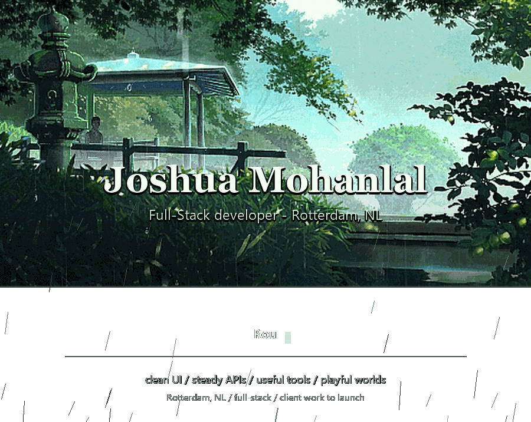

<!-- ============================================================
     attunes · profile readme
     animated rain garden
============================================================ -->

<picture>
  <source media="(prefers-color-scheme: dark)" srcset="assets/hero-typewriter.gif">
  
</picture>

---

### Hi, I'm Joshua.

Full-stack developer in Rotterdam building practical web apps, internal tools, and client projects from rough idea to production. I move across UI, APIs, databases, hosting, and the finishing touches that make something feel ready to use.

Right now I'm building **ContextSnip**, a cross-platform desktop app for turning screen recordings into AI-friendly screenshots and transcripts, and **SoWhatsThePlan**, a travel planning tool for shaping loose ideas into real trips. Around that, I ship client work end-to-end.

### Currently

- Building client work and internal tooling end-to-end
- Studying Computer Science at Hogeschool Rotterdam
- Working through Azure certs: AZ-900 done, AZ-104 next
- Open to freelance work, especially useful tools, websites, and launch-ready systems

### Tech I actually reach for

  
   
  
   
  

Also comfortable in Liquid, Shopify, Roblox Studio, hosting, custom systems, and whatever else a project needs.

---

### Stats

  

  

---

### Selected work

Most of what I build lives with clients, not publicly on GitHub. See selected projects, services, and how I work at  
**[joshuamohanlal.com](https://joshuamohanlal.com)**

### Also building

I design and develop Roblox games on the side: worldbuilding, mechanics, systems, and a different kind of problem-solving than web work.

---

### Get in touch

